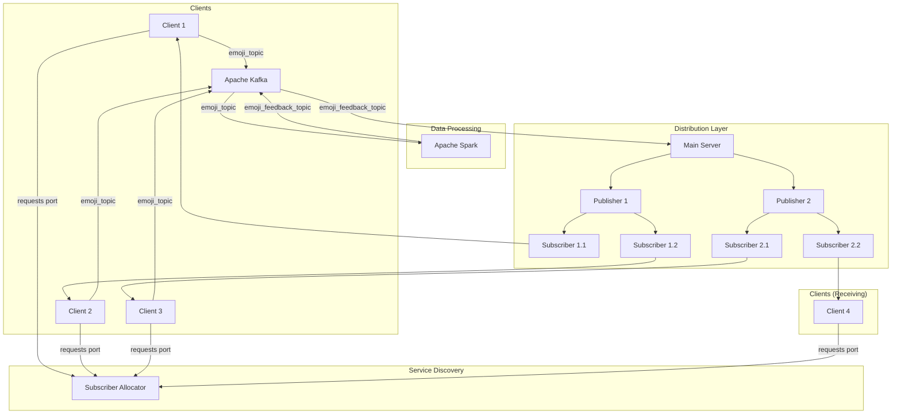

# High-Level Design (HLD) for EmoStreams

## 1. Introduction

EmoStreams is a real-time, event-driven emoji broadcasting system. It enables multiple clients to send emoji reactions, which are then processed in real-time and distributed to other clients. The system is designed for high scalability and resilience, leveraging a modern technology stack that includes Apache Kafka for message brokering and Apache Spark for stream processing. This architecture allows for the efficient handling of a large volume of events, making it suitable for applications such as live streaming, online gaming, and interactive presentations.

## 2. Architecture

The architecture of EmoStreams is based on a distributed, event-driven model. It consists of several decoupled components that communicate with each other through a central message broker (Kafka). This design allows for independent scaling and development of each component.

### Architecture Diagram



## 3. Data Flow

The data flow in EmoStreams is unidirectional, starting from the clients and ending back at the clients after processing.

1.  **Emoji Submission:** Clients send emoji data, which includes a `user_id`, `emoji_type`, and `timestamp`, to the `emoji_topic` in Apache Kafka.
2.  **Stream Processing:** An Apache Spark Streaming job continuously consumes data from the `emoji_topic`. It aggregates the emoji counts over a 2-second sliding window.
3.  **Threshold-based Feedback:** If the count of a particular emoji type within a window reaches a predefined threshold (e.g., 10), Spark sends a message to the `emoji_feedback_topic` in Kafka. This message contains the `emoji_type`, the threshold `count`, and the `timestamp` of the window.
4.  **Central Consumption:** The Main Server, a Node.js application, consumes the processed data from the `emoji_feedback_topic`.
5.  **Hierarchical Distribution:** The Main Server forwards the data to all registered Publishers. Each Publisher, in turn, forwards the data to its registered Subscribers.
6.  **Client Reception:** Subscribers deliver the data to their registered clients. The clients then display the emoji feedback, for instance, by showing the emoji on the screen a certain number of times.
7.  **Service Discovery:** When a client starts, it contacts the Subscriber Allocator to get the port of a subscriber it should connect to. This allows for dynamic load balancing of clients across subscribers.

## 4. Components

### 4.1. Clients

*   **Description:** Node.js applications that serve as the user interface for the system.
*   **Responsibilities:**
    *   Send emoji data to the `emoji_topic` in Kafka.
    *   Receive processed emoji data from a Subscriber and display it.
    *   On startup, get a Subscriber's port from the Subscriber Allocator and register with that Subscriber.
*   **Technology:** Node.js, Express, kafkajs, node-fetch.

### 4.2. Subscriber Allocator

*   **Description:** A simple Node.js/Express server for service discovery.
*   **Responsibilities:**
    *   Maintain a list of available Subscriber ports.
    *   Provide a random Subscriber port to clients upon request.
*   **Technology:** Node.js, Express.

### 4.3. Apache Kafka

*   **Description:** A distributed streaming platform that acts as the central message broker.
*   **Responsibilities:**
    *   Decouple the producers (Clients, Spark) from the consumers (Spark, Main Server).
    *   Provide two topics:
        *   `emoji_topic`: For raw emoji data from clients.
        *   `emoji_feedback_topic`: For processed, aggregated data from Spark.
*   **Technology:** Apache Kafka.

### 4.4. Spark Processor

*   **Description:** A PySpark Streaming job that processes the emoji data in real-time.
*   **Responsibilities:**
    *   Consume data from the `emoji_topic`.
    *   Aggregate emoji counts in 2-second windows.
    *   Apply a threshold to the aggregated counts.
    *   Send feedback data to the `emoji_feedback_topic`.
*   **Technology:** Python, Apache Spark (PySpark), confluent-kafka.

### 4.5. Main Server

*   **Description:** A Node.js/Express server that acts as the central hub for data distribution.
*   **Responsibilities:**
    *   Consume processed data from the `emoji_feedback_topic`.
    *   Manage a list of registered Publishers.
    *   Forward data to all registered Publishers.
*   **Technology:** Node.js, Express, kafkajs.

### 4.6. Publishers

*   **Description:** Node.js/Express servers that act as an intermediate layer for data distribution.
*   **Responsibilities:**
    *   Register with the Main Server on startup.
    *   Manage a list of registered Subscribers.
    *   Receive data from the Main Server and forward it to their Subscribers.
*   **Technology:** Node.js, Express, node-fetch.

### 4.7. Subscribers

*   **Description:** Node.js/Express servers that deliver data to the clients.
*   **Responsibilities:**
    *   Register with a Publisher on startup.
    *   Manage a list of registered Clients.
    *   Receive data from their Publisher and forward it to their Clients.
*   **Technology:** Node.js, Express, node-fetch.

## 5. Technologies Used

*   **Backend:** Node.js with Express framework.
*   **Data Processing:** Python with Apache Spark (PySpark).
*   **Message Broker:** Apache Kafka.
*   **Languages:** JavaScript (Node.js), Python.
*   **Key Libraries:**
    *   `kafkajs`: Kafka client for Node.js.
    *   `confluent-kafka`: Kafka client for Python.
    *   `pyspark`: Python API for Spark.
    *   `node-fetch`: For making HTTP requests in Node.js.

## 6. Database/Data Storage

This project does not use a traditional database. Instead, it relies on Apache Kafka for data storage and stream processing.

*   **`emoji_topic`:** This Kafka topic stores the raw emoji data sent by the clients. Kafka's distributed nature ensures that this data is stored reliably and can be consumed by multiple consumers.
*   **`emoji_feedback_topic`:** This topic stores the processed data from Spark. This data is also stored durably in Kafka until it is consumed by the Main Server.

The state of the system (e.g., registered publishers, subscribers, clients) is stored in-memory in the respective Node.js applications. In a production environment, this state could be moved to a more persistent store like Redis or a database.

## 7. Scalability and Resilience

*   **Scalability:**
    *   **Kafka:** Kafka is inherently scalable and can be run as a cluster to handle a high volume of messages.
    *   **Spark:** Spark can be run in a cluster mode (e.g., on YARN or Kubernetes) to distribute the processing load.
    *   **Node.js Services:** The Node.js services (Publishers, Subscribers, Clients) can be scaled horizontally. You can run multiple instances of each service to handle more connections and distribute the load. The Subscriber Allocator helps in distributing clients among the available subscribers.
*   **Resilience:**
    *   **Kafka:** Kafka provides data replication, which means that if one broker fails, the data is still available on other brokers.
    *   **Spark:** Spark Streaming has built-in fault tolerance mechanisms. If a worker node fails, Spark can restart the failed tasks on another node.
    *   **Node.js Services:** If a Publisher or Subscriber fails, the clients connected to it will be disconnected. However, the rest of the system will continue to function. In a more advanced setup, you could implement a mechanism for clients to automatically reconnect to another available subscriber.

## 8. How to Run the Project

1.  **Prerequisites:**
    *   Java installed (for Kafka and Spark).
    *   Apache Kafka installed.
    *   Apache Spark installed.
    *   Node.js and npm installed.
    *   Python and pip installed.

2.  **Install Python Dependencies:**
    ```bash
    pip install pyspark confluent-kafka
    ```

3.  **Start Zookeeper and Kafka:**
    *   Start Zookeeper: `bin/zookeeper-server-start.sh config/zookeeper.properties`
    *   Start Kafka: `bin/kafka-server-start.sh config/server.properties`
    *   Create the Kafka topics:
        ```bash
        bin/kafka-topics.sh --create --topic emoji_topic --bootstrap-server localhost:9092
        bin/kafka-topics.sh --create --topic emoji_feedback_topic --bootstrap-server localhost:9092
        ```

4.  **Start the Spark Processor:**
    *   Run the `spark.py` script: `spark-submit --packages org.apache.spark:spark-sql-kafka-0-10_2.12:3.1.1 final/spark.py`

5.  **Start the Node.js Servers:**
    *   In each of the `final` subdirectories containing a `package.json` (or for each `.js` file if no `package.json` is present), install the dependencies: `npm install express kafkajs node-fetch`
    *   Start the servers in separate terminal windows, in the following order:
        1.  **Main Server:** `node final/Server.js`
        2.  **Subscriber Allocator:** `node final/Sub_alloc.js`
        3.  **Publishers:**
            *   `node final/Publisher1.js`
            *   `node final/Publisher2.js`
            *   `node final/Publisher3.js`
        4.  **Subscribers:**
            *   `node final/Subscriber1_1.js`
            *   `node final/Subscriber1_2.js`
            *   `node final/Subscriber2_1.js`
            *   `node final/Subscriber2_2.js`
            *   `node final/Subscriber3_1.js`
            *   `node final/Subscriber3_2.js`
        5.  **Clients:**
            *   `node final/Client0.js`
            *   `node final/Client1.js`
            *   ...and so on.

## 9. Core Concepts for Interviews

### Q: What is the role of Kafka in this project? Why did you choose it?

**A:** In this project, Kafka serves as the central nervous system. It's a distributed message broker that decouples the different components of the system.

*   **Decoupling:** Clients that produce emoji data don't need to know about the Spark processor that consumes it. Similarly, the Spark processor doesn't know about the Main Server. This makes the system more modular and easier to maintain.
*   **Buffering:** Kafka acts as a buffer, absorbing the high volume of emoji data from the clients and allowing the Spark processor to consume it at its own pace.
*   **Scalability & Durability:** Kafka is highly scalable and can handle millions of messages per second. It's also durable, meaning it persists messages to disk, which prevents data loss in case of a consumer failure.

I chose Kafka because it's the industry standard for building real-time data pipelines and event-driven architectures. Its features perfectly match the requirements of this project.

### Q: Can you explain the Spark Streaming part? What is the windowing function doing?

**A:** The Spark Streaming part is responsible for processing the raw emoji data in real-time.

*   It reads a continuous stream of data from the `emoji_topic` in Kafka.
*   The `window()` function is used to group the data into time-based windows. In this project, it's a 2-second window. This means that every 2 seconds, Spark processes all the emojis that arrived in that time frame.
*   Within each window, it aggregates the data by `emoji_type` to get a count of each emoji.
*   It then applies a threshold to these counts. If the count of an emoji is high enough, it means that many users are sending that emoji at the same time. In this case, it sends a summary message to the `emoji_feedback_topic`. This prevents the system from being flooded with individual emoji messages and instead sends a more meaningful, aggregated feedback.

### Q: Why is there a hierarchical structure of Publishers and Subscribers? Why not have the Main Server send data directly to the clients?

**A:** The Publisher-Subscriber hierarchy is a design pattern used to improve scalability and reduce the load on the Main Server.

*   **Load Distribution:** If the Main Server had to send data to thousands or millions of clients directly, it would become a bottleneck. By introducing Publishers and Subscribers, we create a tree-like distribution network. The Main Server only needs to send data to a few Publishers. Each Publisher then sends it to a set of Subscribers, and each Subscriber sends it to a set of clients. This distributes the connection load across multiple servers.
*   **Scalability:** This architecture allows for horizontal scaling. If we need to support more clients, we can simply add more Subscribers and Publishers to the network without affecting the Main Server.
*   **Geographical Distribution:** In a real-world scenario, Publishers and Subscribers could be located in different geographical regions to reduce latency for clients in those regions.

### Q: How are the different services connected? How are the "database connections" made?

**A:** The services are connected in two ways: through HTTP requests and through Kafka.

*   **HTTP Requests:** The Node.js services (Clients, Subscribers, Publishers, Main Server, Subscriber Allocator) communicate with each other via REST APIs over HTTP. For example, a client makes an HTTP POST request to a subscriber to register itself. The `node-fetch` library is used for this.
*   **Kafka Connections:** The "database connections" in this project are actually connections to the Kafka brokers.
    *   The Node.js services use the `kafkajs` library to create Kafka producers and consumers. The connection is established by providing the address of the Kafka brokers (e.g., `localhost:9092`).
    *   The Python Spark script uses the `confluent-kafka` library for producing messages and the built-in Spark-Kafka connector for consuming messages. The connection details are provided in the configuration.

These connections are typically established once when the service starts and are maintained throughout the lifetime of the service.
