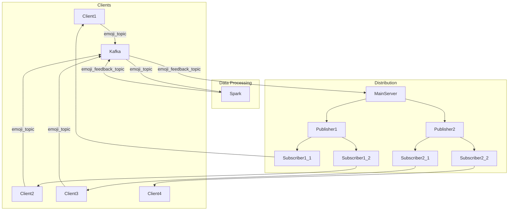

# EC-Team-25-emostream-concurrent-emoji-broadcast-over-event-driven-architecture

This project is a real-time emoji broadcasting system built on an event-driven architecture. It allows multiple clients to send emoji reactions, which are then processed and broadcasted to other clients in real-time. The system is designed to be scalable and resilient, using technologies like Apache Kafka for message brokering and Apache Spark for real-time data processing.

## High-Level Design

### Architecture Diagram

### Data Flow

1.  **Clients send emoji data:** Clients send emoji data (user ID, emoji type, timestamp) to the `emoji_topic` in Kafka.
2.  **Spark processes the data:** A Spark Streaming job consumes the data from the `emoji_topic`, aggregates the emoji counts in 2-second windows, and sends the aggregated data to the `emoji_feedback_topic` in Kafka if a certain threshold is met.
3.  **Main server consumes the processed data:** The main server consumes the aggregated data from the `emoji_feedback_topic`.
4.  **Publishers distribute the data:** The main server forwards the data to all registered publishers.
5.  **Subscribers receive the data:** Publishers forward the data to their registered subscribers.
6.  **Clients receive the data:** Subscribers forward the data to their registered clients, which then display the emoji feedback.

## Components

*   **Clients:**
    *   The clients are Node.js applications that perform two main functions:
        1.  They send emoji data to the `emoji_topic` in Kafka.
        2.  They listen for processed emoji data from a subscriber and display it.
    *   Each client has a unique port and registers with a subscriber to receive data.
    *   Clients get the subscriber port from the Subscriber Allocator.

*   **Subscriber Allocator:**
    *   A simple Node.js/Express server that allocates a random subscriber port to a client.
    *   This allows for dynamic load balancing of clients across subscribers.

*   **Kafka:**
    *   Apache Kafka is used as a message broker for the system.
    *   It has two topics:
        *   `emoji_topic`: Clients send raw emoji data to this topic.
        *   `emoji_feedback_topic`: The Spark job sends processed emoji data to this topic.

*   **Spark Processor:**
    *   A PySpark Streaming job that consumes data from the `emoji_topic`.
    *   It aggregates the emoji counts in 2-second windows.
    *   If the count for an emoji reaches a certain threshold, it sends the aggregated data to the `emoji_feedback_topic`.

*   **Main Server:**
    *   A Node.js/Express server that consumes processed emoji data from the `emoji_feedback_topic`.
    *   It acts as a central hub for distributing the data to the publishers.
    *   Publishers register with the main server to receive data.

*   **Publishers:**
    *   Node.js/Express servers that receive data from the main server.
    *   They act as middlemen, forwarding the data to their registered subscribers.
    *   This allows for a hierarchical distribution of data, which can improve scalability.

*   **Subscribers:**
    *   Node.js/Express servers that receive data from a publisher.
    *   They forward the data to their registered clients.

## How to Run

1.  **Start Zookeeper and Kafka:**
    *   You will need to have Zookeeper and Kafka installed and running.
    *   Start Zookeeper: `bin/zookeeper-server-start.sh config/zookeeper.properties`
    *   Start Kafka: `bin/kafka-server-start.sh config/server.properties`
    *   Create the Kafka topics:
        *   `bin/kafka-topics.sh --create --topic emoji_topic --bootstrap-server localhost:9092`
        *   `bin/kafka-topics.sh --create --topic emoji_feedback_topic --bootstrap-server localhost:9092`

2.  **Start the Spark Processor:**
    *   You will need to have Apache Spark installed.
    *   Run the `spark.py` script: `spark-submit --packages org.apache.spark:spark-sql-kafka-0-10_2.12:3.1.1 final/spark.py`

3.  **Start the Node.js Servers:**
    *   You will need to have Node.js and npm installed.
    *   Install the dependencies for each Node.js application: `npm install`
    *   Start the servers in the following order:
        1.  **Main Server:** `node final/Server.js`
        2.  **Subscriber Allocator:** `node final/Sub_alloc.js`
        3.  **Publishers:**
            *   `node final/Publisher1.js`
            *   `node final/Publisher2.js`
            *   `node final/Publisher3.js`
        4.  **Subscribers:**
            *   `node final/Subscriber1_1.js`
            *   `node final/Subscriber1_2.js`
            *   `node final/Subscriber2_1.js`
            *   `node final/Subscriber2_2.js`
            *   `node final/Subscriber3_1.js`
            *   `node final/Subscriber3_2.js`
        5.  **Clients:**
            *   `node final/Client0.js`
            *   `node final/Client1.js`
            *   `node final/Client2.js`
            *   ...and so on.

## Dependencies

*   **Node.js:**
    *   `express`: A web framework for Node.js.
    *   `kafkajs`: A Kafka client for Node.js.
    *   `node-fetch`: A module for making HTTP requests.

*   **Python:**
    *   `pyspark`: The Python API for Apache Spark.
    *   `confluent-kafka`: A Kafka client for Python.

*   **Other:**
    *   **Apache Kafka:** A distributed streaming platform.
    *   **Apache Spark:** A unified analytics engine for large-scale data processing.
    *   **Java:** Required for running Kafka and Spark.
